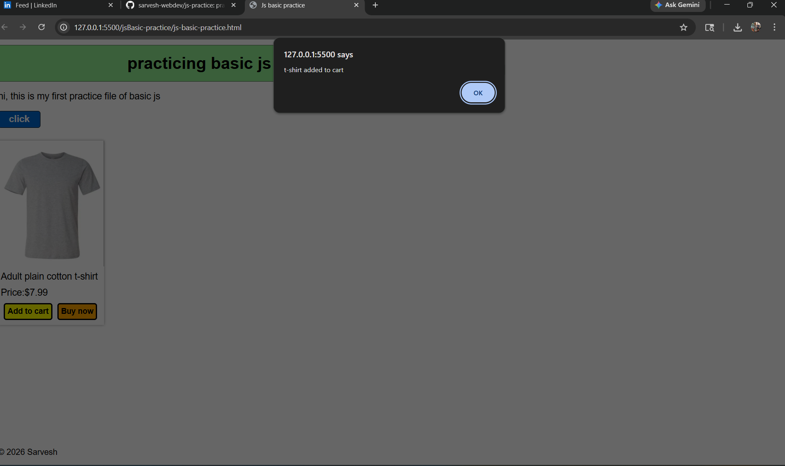
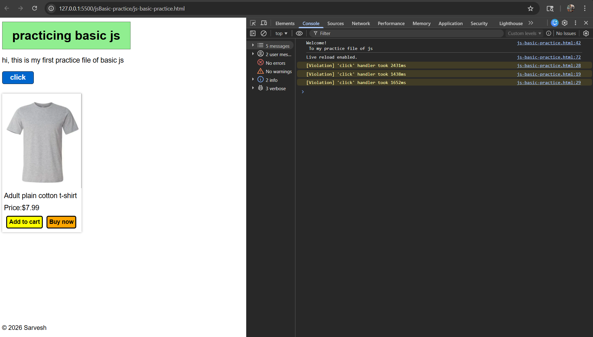
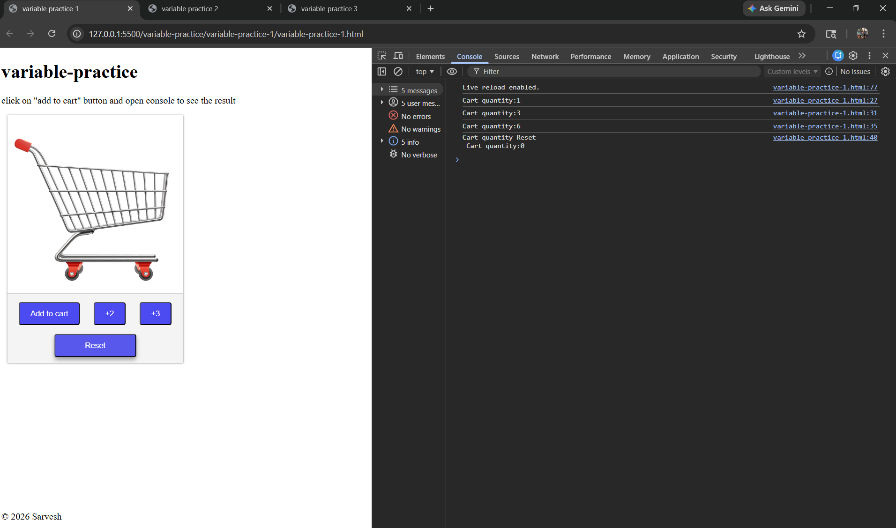
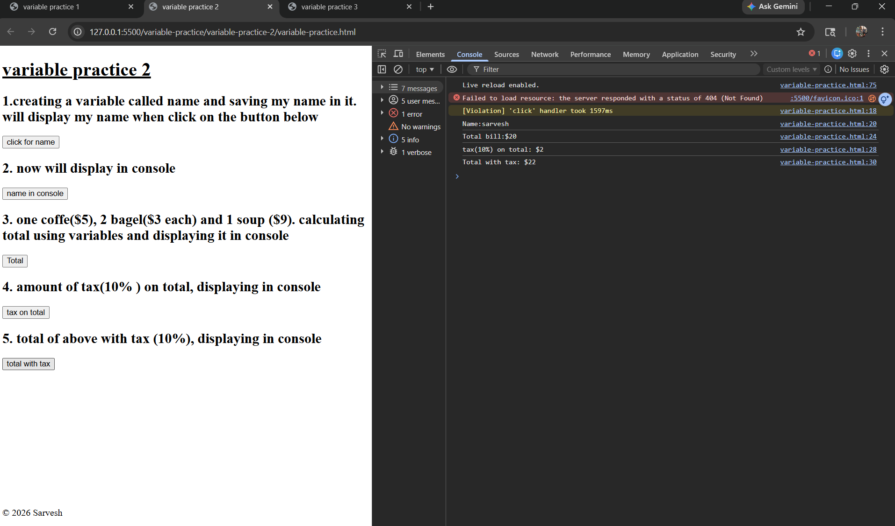
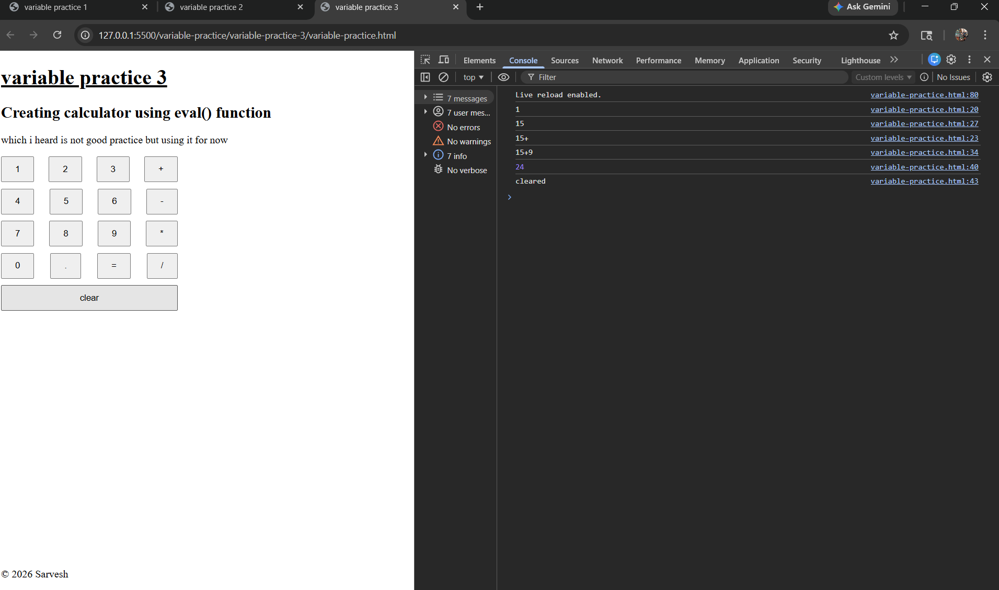

# JavaScript Practice

This repository contains my practice exercises for learning JavaScript basics and beyond.  
Each folder represents a different set of topics or experiments.
---

## ScreenShots of Pracitce
- js basic practice 
 
 

 
 

 
 

- variable-practice
 
 

 
 

 
 

---

## 📂 Folder Structure
- **jsBasic-practice/** → introductory scripts and small experiments  
- **variable-practice/** -> contain 3 folders with different practices described below

---

## 📘 Practice Details

### 1. js-basic-practice
Introductory scripts focusing on fundamental JavaScript concepts.

**Topics Covered**
- `onclick` events → attaching event handlers to buttons and elements  
- `alert()` → displaying simple pop‑up messages to interact with the user  
- `console.log()` → printing values to the console for debugging and learning  

### 2. js-variable practice
 Introduction to variable created some things using that

- in 1st practice folder created a cart variable which gets updated or cleared when button is clicked , showed the updated quantity in console
- in 2nd practice folder tried to display string or prices in console when button is clicked
-in 3rd made a calculator using Math.eval(), not best method but using it for now

